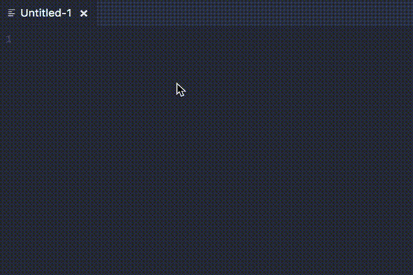

# vscode-language-todo

Add TODO support in VS Code.

> Syntaxes converted from [atom/language-todo](https://github.com/atom/language-todo).



## Feature

- Adds syntax highlighting to `TODO, FIXME, CHANGED, XXX, IDEA, HACK, NOTE, REVIEW, NB, BUG, QUESTION, COMBAK, TEMP, DEBUG and OPTIMIZE` in comments and text in [Support file](#support-files).
- List All TODOs in current workspace.
- Snippets [#see](#snippets)

## Support files

- JavaScript
- CSS
- HTML
- Markdown ([#enable](#markdown-fix))
- jsx (snippet bugly in render section)
- TypeScript
- CoffeeScript
- Ruby
- Python
- PHP
- Go
- SASS (only .scss)
- Less
- Vue

## Snippets

Typing `todo` or other abbreviation, you will see the abbreviation displayed in the suggestion list.

To ensure snippet suggestions are always on top in the suggestion list, add the following setting:

```json
"editor.snippetSuggestions": "top"
```

## Commands

Using Command Palette (CMD/CTRL + Shift + P)

- `vltodo.search`(List All TODOs)

## Configuration

The extension can be customised as follows:

```json
"vscode-language-todo.regex": "(//|#|<!--|;|/*)\\s*(TODO|FIXME)", // the regex to find TODOs for ripgrep, This is a `Rust regular expression`
"vscode-language-todo.rootFolder": "", // The search starts in your workspace folder
"vscode-language-todo.globs": [ // A list of globs, the files which are searched
    "!**/node_modules/**",
    "!**/bower_components/**",
    "!**/.vscode/**",
    "!**/.github/**",
    "!**/.git/**",
    "!**/*.map"
]
```

## Customizations

You can tune the syntax highlighting colors using the `editor.tokenColorCustomizations` setting:

```
"editor.tokenColorCustomizations": {
    "textMateRules":[
        {
            "scope": "storage.type.class.todo",
            "settings": {
                "foreground": "#c792ea"
            }
        },
        {
            "scope": "storage.type.class.fixme",
            "settings": {
                "foreground": "#ff0000"
            }
        }
    ]
}
```

Rules syntax `scope` will be `storage.type.class.todo` / `storage.type.class.fixme` / `storage.type.class.changed` ...

## Known Issues

- [x] Snippet not work in markdown

    <a name="markdown-fix"></a>Quick suggestions are disabled by default in markdown files, add the following setting to enable:

    ```json
    "[markdown]":  {
        "editor.quickSuggestions": true
    }
    ```

- [x] Syntaxes not work in `.vue`
- [ ] snippet bugly in `.jsx` render section
